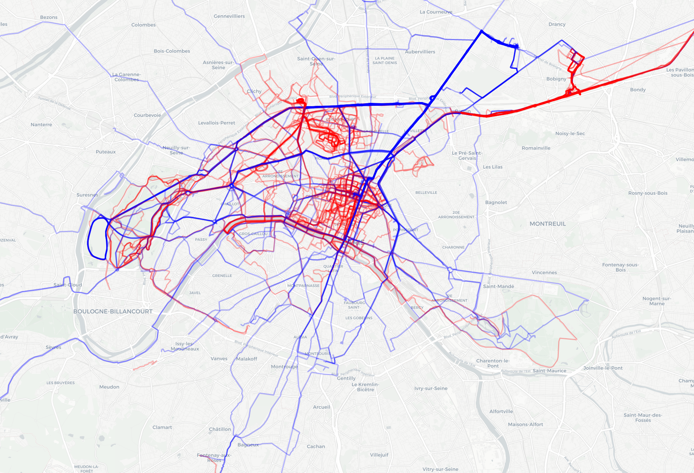

# MySportData

App to show heatmap of all the activities using Strava API

Current ideas
- use socket io to show update info data in real time

Progress

(- Last complete update
- complete database
- update unly until last complete update)

To Do
- Authorizing Strava via website (https://stackoverflow.com/questions/9499286/using-google-oauth2-with-flask/45746752
https://realpython.com/flask-google-login/)
- Flask functionalities
- Snap activity tracks to the roads

Resources
- Strava API
- OpenStreetMap
- Folium
