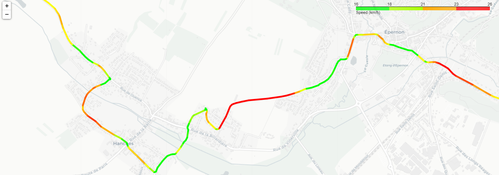

# MySportData

App to show heatmap of all the activities using Strava API

### Map of all the activities


### Speed map of single activity


### Altitude map of single activity


## How to use (local server)
1. Copy the repository
```
git clone https://github.com/MrDajman/MySportData.git
```
2. Install the requirements
```
pip install -r requirements.txt
```
3. Run the app
```
python main.py
```
4. Go to http://127.0.0.1:5000/


## Current functionalities
- Loging in via Strava
- User database
- Storing activities in the database
- **Interactive map with all the activities**
- **Interactive map with color trail for the speed of an activity**


## To Do
- Refreshing tokens when 
- Last complete update
- Extra functionality (single activity map)
- Snap activity tracks to the roads

## Done
- Authorizing Strava via website

## Resources
- Strava API
- Flask, flask_sqlachemy
- OpenStreetMap
- Folium
